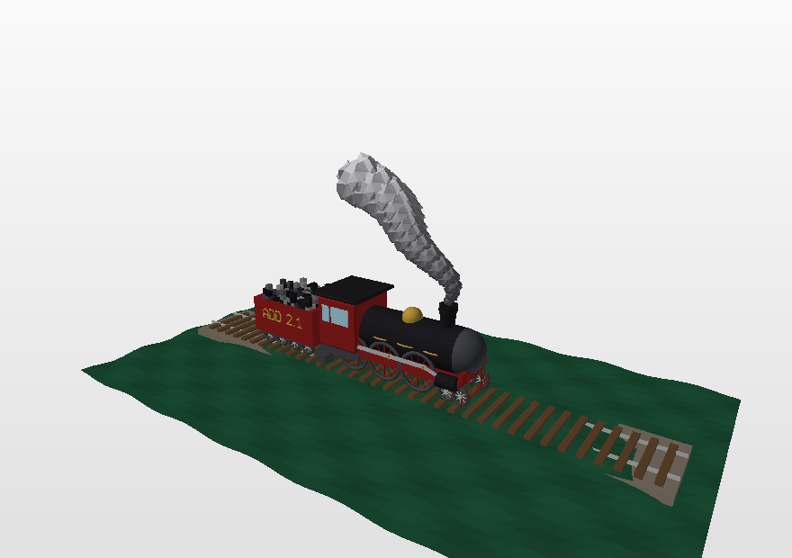
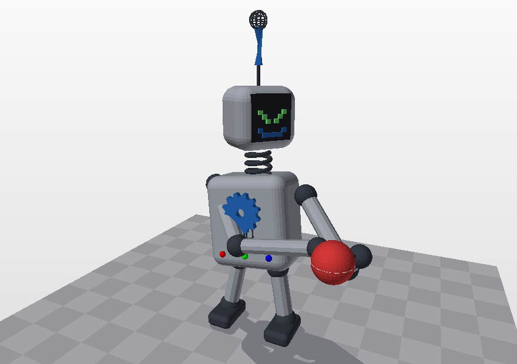

# add.py

**3D modeliai, sukurti vien tik programiniu kodu.**

Vienas failas. Tik `math` ir `random`. Jokios modeliavimo programos, jokios
geometrijos bibliotekos, nieko diegti nereikia.

[Dokumentacija](https://martynas-sabaliauskas.github.io/add3d/) &middot;
[Galerija](https://martynas-sabaliauskas.github.io/add3d/#gallery) &middot;
[In English](README.md)

```python
import add

add.box([0, 0, 0], 2, "red")
add.sphere([3, 0, 0], 1, 20, "blue")
add.cylinder([0, 2, 0], [3, 2, 0], 0.3, 24, "gold")

add.check()                      # 2478 daugiakampiai, 3 spalvos, uždaras
add.save("pirmas_modelis.off")   # arba .obj (+ .mtl), .ply, .stl
```

<p align="center">
  
  
  
  
</p>

Nė vienas jų nenupieštas ranka. Kiekvienas – viena trumpa programa
[`examples/`](examples/) aplanke.

---

## Kam to reikia

`add.py` parašytas antro kurso universiteto kursui, kuriame studentams
skiriama sąmoningai nepatogi užduotis: **sukurti 3D modelį, bet neliesti
jokios modeliavimo programos ir neatsisiųsti jokio paruošto modelio.**
Viskas turi būti apskaičiuota jūsų pačių parašyta formule arba ciklu.

Paaiškėja, kad atimti įrankiai darbą padaro ne nuobodesnį, o įdomesnį. Sfera
nustoja būti mygtuku įrankių juostoje ir tampa trimis trigonometrijos
eilutėmis. Šachmatų figūra tampa kreive, sukama apie ašį. Miestas tampa
atsitiktinių skaičių generatoriumi ir dviem ciklais. Nustojate matyti figūras
ir pradedate matyti matematiką jų viduje.

Biblioteka tam ir yra, kad įdomioji dalis – geometrija – liktų jums, o
nuobodžioji – viršūnių indeksų sekimas ir failo rašymas – ne.

## Kaip pradėti

Diegti nieko nereikia. Atsisiųskite [`add.py`](add.py), padėkite šalia savo
programos ir parašykite `import add`. Reikia tik Python 3 – net `import
math` nebūtinas: `math` ir `random` eksportuojami iš paties modulio, todėl
veikia `add.sin`, `add.pi`, `add.randint` ir `add.seed`.

```bash
curl -O https://raw.githubusercontent.com/martynas-sabaliauskas/add3d/main/add.py
```

Arba klonuokite repozitoriją – tada gausite ir pavyzdžius, ir testus, ir
dokumentaciją. (Modulis vadinasi `add.py`; repozitorija ir paketas – `add3d`,
nes vardas `add` PyPI kataloge užimtas kito žmogaus tuščiu įrašu – žr.
[PUBLISHING.lt.md](PUBLISHING.lt.md).)

## Kas viduje

| | |
|---|---|
| **Figūros** | kubas, gretasienis, suapvalinta dėžė, karkasas, piramidė, prizmė, penki Platono kūnai, sfera, pusrutulis, elipsoidas, toras, kapsulė, cilindras, vamzdis, kūgis, nupjautinis kūgis, tuščiaviduris vamzdis, skritulys, žiedas, tinklelis, rodyklė, spiralė, kubeliai |
| **Detalės** | `beam` (sija tarp dviejų taškų), `arch`, `stairs`, `gear`, `wheel`, `roof`, `column`, `bricks`, `tree`, `pixels` (pikselinis piešinys), `heightmap` (kubelių reljefas), `wireframe`, `text` (įmontuotas šriftas su lietuviškomis raidėmis) |
| **Paviršiai** | `parametric(S, ...)` bet kokiai `S(u, v)` funkcijai – su siūlių uždarymu, tikru storiu, dvipusiais lakštais ir *spalvos funkcija* nuo `(u, v)` |
| **Sukimas ir tempimas** | `revolve` (sukinys), `sweep` išilgai 3D kelio su mastelio ir sukimo keitimu, `extrude`, `loft`, `curve` / `polyline` (vamzdžiai), `ribbon`, `trace` (vektorinio lauko trajektorija) |
| **Profiliai** | paruošti skerspjūviai: apskritimas, elipsė, daugiakampis, žvaigždė, suapvalintas stačiakampis, krumpliaratis; `chaikin` kampų apvalinimas |
| **Transformacijos** | stūmimas, sukimas apie bet kokią ašį, mastelis, tempimas, veidrodis, `place`, `fit`, `aim`, `ground`, `align`, `twist`, `bend`, `taper`, `jitter` ir `deform` su bet kokia jūsų funkcija |
| **Kopijos** | `repeat`, tiesiniai / tinklelio / žiediniai / veidrodiniai masyvai, `scatter` atsitiktiniuose taškuose, `along` išilgai kreivės |
| **Loginės operacijos** | `union`, `intersect`, `difference`, `symmetric_difference` ir pigesnis `cut` plokštuma |
| **Taisymas** | `clean` (viršūnių klijavimas, dublikatų ir vidinių sienų šalinimas), `heal`, `fix_normals`, `triangulate` |
| **Spalvos** | vardinės spalvos, hex, HSV, perėjimai ir `color_by` – spalva pagal padėtį |
| **Failai** | rašo `.off`, `.obj` + `.mtl`, `.ply`, `.stl`; skaito `.off`, `.obj`, `.ply` |
| **Tikrinimas** | `stats()` ir `check()` – daugiakampių skaičius, spalvos, uždarumas, tūris |
| **Peržiūra** | `tools/preview.py` – atvaizdavimo įrankis, irgi be jokių priklausomybių |

178 viešų vardų, visi su aprašymais, viename 4700 eilučių faile, kurį galima
perskaityti.

## Loginės operacijos, parašytos nuo nulio

Vieno kūno iškirpimas iš kito yra ta vieta, kur dažniausiai tikimasi
bibliotekos. Čia tai padaryta maždaug šešiais šimtais eilučių gryno Python:

1. Kiekviena siena perpjaunama ten, kur ją galėtų kirsti kito kūno
   trikampiai; kaimynai randami per erdvinį tinklelį, o pjaustoma
   palaipsniui, todėl siena nustoja būti pjaustoma, kai tik atitolsta.
2. Kiekvienos dalies klausiama, ar ji viduje, išorėje, ar guli ant kito kūno
   paviršiaus – paleidžiant spindulį ir skaičiuojant susikirtimus.
3. Paliekamos tos dalys, kurių prašo operacija.

6000 sienų sfera minus dėžė užtrunka apie pusę sekundės, 25000 sienų – apie
dvi. Rezultatas suklijuotas, plyšeliai užtaisyti, paviršius uždaras.

```python
add.cuboid([0, 0, 0], [4, 1, 4], "brown")
plokste = add.layer()
add.cylinder([0, -1, 0], [0, 1, 0], 0.6, 32, "black")
grezlas = add.layer()
add.mesh(add.difference(plokste, grezlas))
```

## Pereinant nuo add.py 1.2

Viskas veikia kaip veikę. 1.2 versijai rašyti modeliai paleidžiami nepakeisti
ir duoda tas pačias sienas – dvylika jų guli [`tests/legacy/`](tests/legacy/)
aplanke, ir testai tikrina būtent tai. Naujame kode verta rinktis aiškesnius
vardus: `cube2` → `frame`, `cylinder2` → `tube`, `cylinder3` → `cup`,
`cone2` → `cone_open`, `spin3D` → `revolve`, `off` → `save`.

## Pilni modeliai

Vėlesni pavyzdžiai – ištisos scenos, kokių prašo kursinė užduotis, kiekviena
apie šimtą eilučių ir kiekviena naudojanti vis kitą bibliotekos kampą:
[švyturio sala](examples/22_lighthouse.py), [garvežys](examples/23_locomotive.py),
kurio trauklės seka ratų kampą, [malūnas](examples/24_windmill.py),
[apvali šventykla](examples/25_temple.py), [keistieji atraktoriai ir vektoriniai
laukai](examples/26_vector_fields.py), [robotas](examples/27_robot.py), siekiantis
kamuolio, [kubelių sala](examples/28_voxel_island.py), [du tiltai](examples/29_bridge.py),
[Saulės sistema](examples/30_solar_system.py) su dryžuotomis planetomis,
[dirbtuvės](examples/31_workbench.py) su matavimo ir taisymo įrankiais,
[natiurmortas](examples/32_old_names.py) 1.2 žodynu ir [skerspjūvių
galerija](examples/33_cross_sections.py). `python3 tools/coverage.py` parodo,
kuris pavyzdys kurią funkciją naudoja; kiekviena vieša funkcija panaudota bent
viename.

## Repozitorijos sandara

```
add.py               biblioteka – vienintelis failas, kurio jums reikia
_src/                dalys, iš kurių surenkamas add.py
build.py             sujungia _src/*.py į add.py
examples/            30 pavyzdinių programų su komentarais (18 studijų, 12 pilnų modelių)
  add.py             bibliotekos kopija, kad pavyzdžiai veiktų tokie, kokie yra
  build_all.py       paleidžia visas ir sugeneruoja paveikslėlius
tools/
  preview.py         atvaizdavimo įrankis be priklausomybių
  make_docs.py       sukuria docs/index.html iš kodo aprašymų
  coverage.py        kuris pavyzdys kurią funkciją naudoja
tests/
  test_add.py        80 vienetinių testų
  test_legacy.py     paleidžia add.py 1.2 modelius ir tikrina sienų skaičių
  legacy/            tie modeliai, nepakeisti
docs/                dokumentacijos svetainė (lietuvių ir anglų kalbomis)
paper/               mokslinis straipsnis apie sandarą ir algoritmus
outreach/            populiarinimo vaizdo įrašo scenarijus ir pranešimo planas
slides/              paskaitos skaidrės
```

Jei keičiate biblioteką, keiskite failus `_src/` aplanke ir paleiskite
`python3 build.py` – `add.py` (ir jo kopija `examples/` aplanke) yra
generuojamas. Jis laikomas repozitorijoje tam, kad studentui reikėtų tik
vieno failo.

## Testai

```bash
python3 tests/test_add.py        # 80 vienetinių testų
python3 tests/test_legacy.py     # add.py 1.2 modeliai
python3 examples/build_all.py    # visi pavyzdžiai ir paveikslėliai
```

Vienetiniai testai tikrina kiekvienos figūros analitinį tūrį – sferą pagal
4/3·πr³, torą pagal 2π²Rr² – ir kad kiekvienas uždaras kūnas tikrai uždaras.

## Kaip pasidalinti modeliu

`save("modelis.obj")` sukuria `.obj` ir `.mtl` failus. Abu sudėkite į vieną
archyvą ir įkelkite į [Sketchfab](https://sketchfab.com) – modelį galės
pasukioti bet kas naršyklėje. 3D spausdinimui naudokite
`save("modelis.stl")` po `clean(..., normals=True)`.

## Publikavimas

[PUBLISHING.lt.md](PUBLISHING.lt.md) paaiškina, kaip įkelti repozitoriją į
GitHub, įjungti dokumentacijos svetainę ir, jei norite, išleisti `add3d` PyPI
kataloge.

## Licencija

MIT. Žr. [LICENSE](LICENSE).

---

Martynas Sabaliauskas, Vilniaus universitetas, Matematikos ir informatikos
fakultetas, Duomenų mokslo ir skaitmeninių technologijų institutas.
