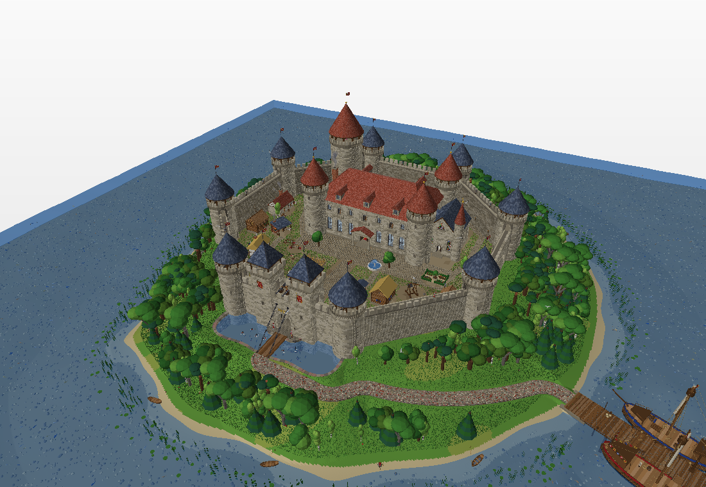
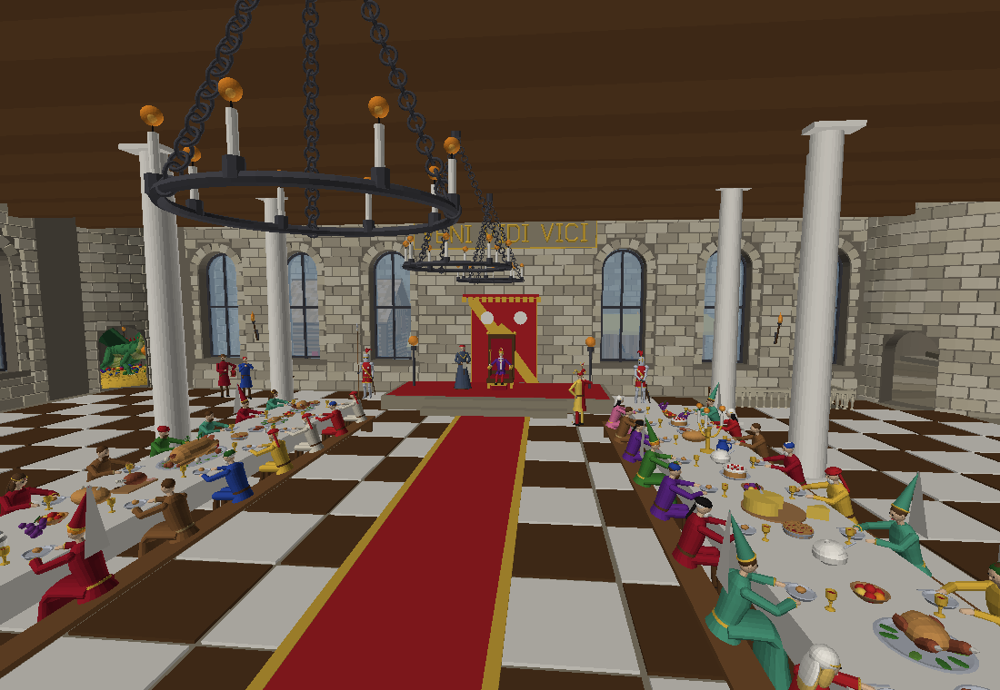
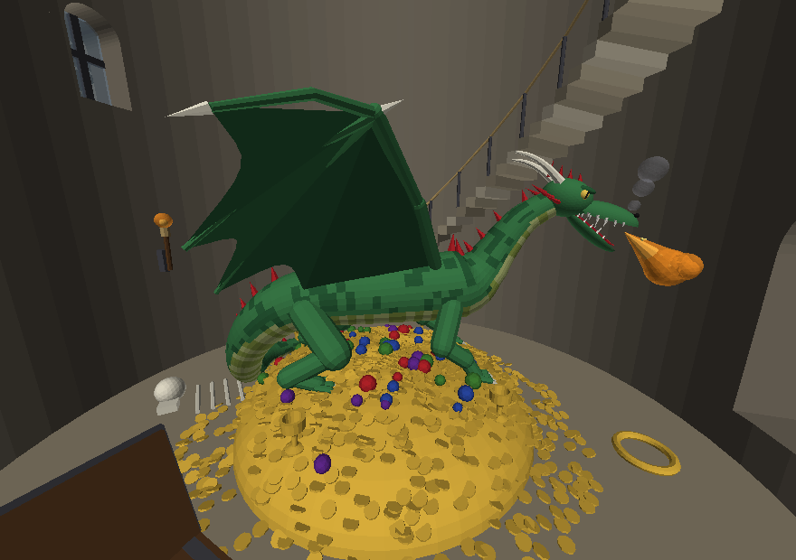
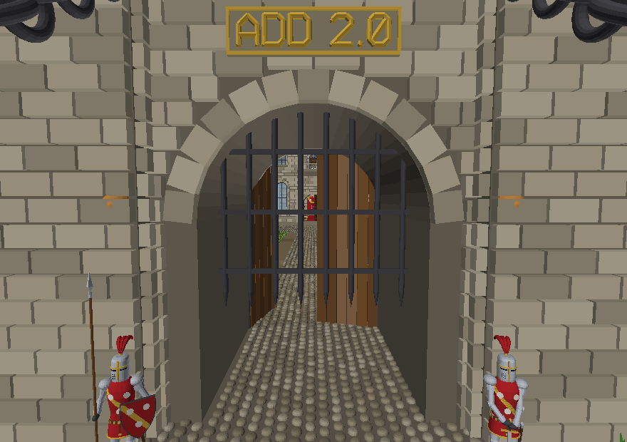
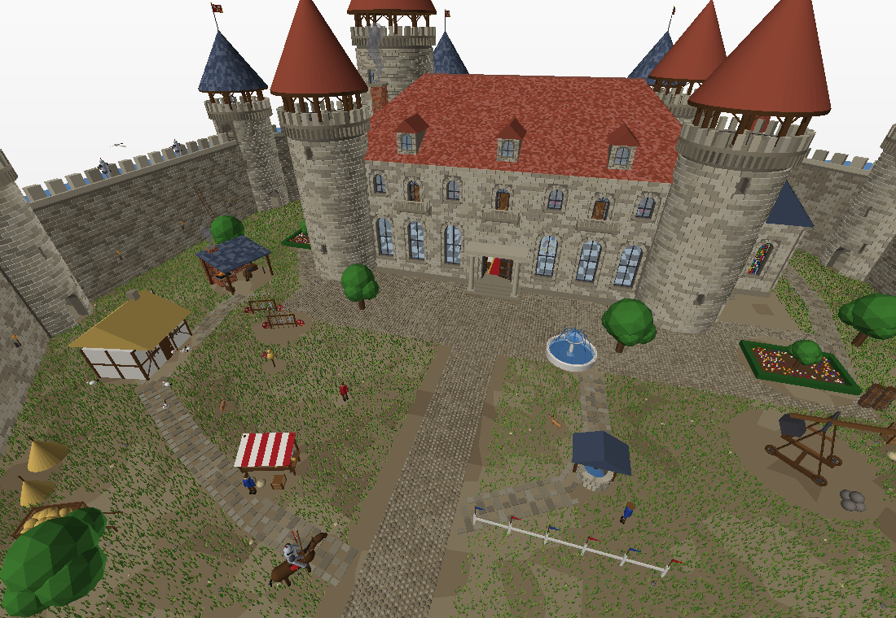
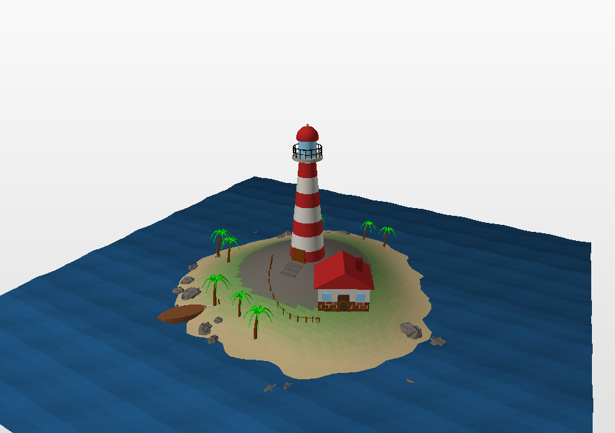
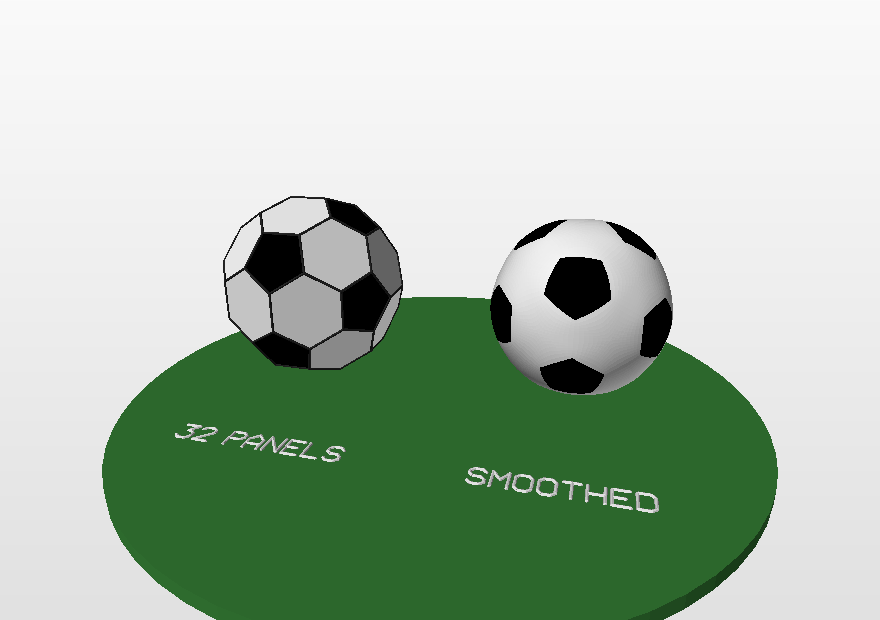
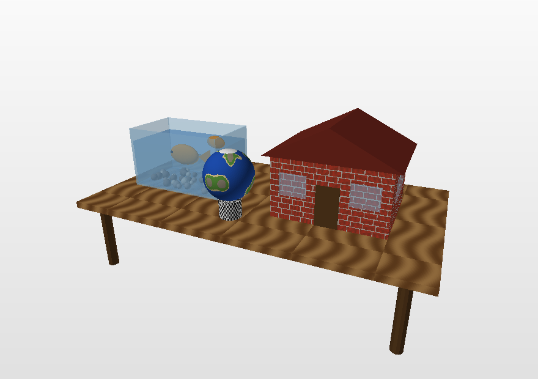
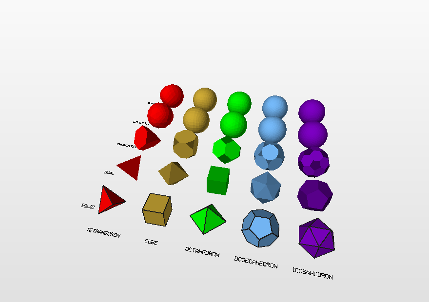

# add.py

**3D modeliai, sukurti vien tik programiniu kodu.**

Vienas failas. Tik `math` ir `random`. Jokios modeliavimo programos, jokios
geometrijos bibliotekos, nieko diegti nereikia.

[Dokumentacija](https://akatasis.github.io/add3d/) &middot;
[Galerija](https://akatasis.github.io/add3d/#gallery) &middot;
[In English](README.md)

```python
import add

add.box([0, 0, 0], 2, "red")
add.sphere([3, 0, 0], 1, 20, "blue")
add.cylinder([0, 2, 0], [3, 2, 0], 0.3, 24, "gold")

add.check()                      # 5198 daugiakampiai, 3 spalvos, uždaras
add.save("pirmas_modelis.off")   # arba .obj (+ .mtl), .ply, .stl
```

<p align="center">
  
  
  
  
  
  
  
  
  
</p>

Nė vienas jų nenupieštas ranka. Kiekvienas – viena trumpa programa
[`examples/`](examples/) aplanke.

---

## Kam to reikia

`add.py` parašytas universiteto kursui, kuriame studentams skiriama
sąmoningai nepatogi užduotis: **sukurti 3D modelį, bet neliesti jokios
modeliavimo programos ir neatsisiųsti jokio paruošto modelio.** Viskas turi
būti apskaičiuota jūsų pačių parašyta formule arba ciklu. Modulis skirtas
studentams ir visiems, kam įdomiau formą sukurti iš matematikos, o ne iš
meniu.

Paaiškėja, kad atimti įrankiai darbą padaro ne nuobodesnį, o įdomesnį. Sfera
nustoja būti mygtuku įrankių juostoje ir tampa trimis trigonometrijos
eilutėmis. Šachmatų figūra tampa kreive, sukama apie ašį. Miestas tampa
atsitiktinių skaičių generatoriumi ir dviem ciklais. Nustojate matyti figūras
ir pradedate matyti matematiką jų viduje.

Biblioteka tam ir yra, kad įdomioji dalis – geometrija – liktų jums, o
nuobodžioji – viršūnių indeksų sekimas ir failo rašymas – ne.

## Kaip pradėti

Diegti nieko nereikia. Atsisiųskite [`add.py`](add.py), padėkite šalia savo
programos ir parašykite `import add`. Reikia tik Python 3 – net `import
math` nebūtinas: `math` ir `random` eksportuojami iš paties modulio, todėl
veikia `add.sin`, `add.pi`, `add.randint` ir `add.seed`.

```bash
curl -O https://raw.githubusercontent.com/akatasis/add3d/main/add.py
```

Arba klonuokite repozitoriją – tada gausite ir pavyzdžius, ir testus, ir
dokumentaciją. (Modulis vadinasi `add.py`; repozitorija ir paketas – `add3d`,
nes vardas `add` PyPI kataloge užimtas kito žmogaus tuščiu įrašu – žr.
[PUBLISHING.lt.md](PUBLISHING.lt.md).)

## Kas viduje

| | |
|---|---|
| **Figūros** | kubas, gretasienis, suapvalinta dėžė, karkasas, piramidė, prizmė, penki taisyklingieji briaunainiai (`tetrahedron` ... `icosahedron`, kiekvieno viršūnių vidurkis – centre), geodezinė `sphere` iš trikampių, `quadsphere`, pusrutulis, elipsoidas, toras, kapsulė, cilindras, vamzdis, kūgis, nupjautinis kūgis, tuščiaviduris vamzdis, skritulys, žiedas, tinklelis, rodyklė, spiralė, kubeliai |
| **Detalės** | `beam` (sija tarp dviejų taškų), `arch`, `stairs`, `gear`, `wheel`, `roof`, `column`, `bricks`, `tree`, `pixels` (pikselinis piešinys), `heightmap` (kubelių reljefas), `wireframe`, `text` (įmontuotas šriftas su lietuviškomis raidėmis) |
| **Paviršiai** | `parametric(S, ...)` bet kokiai `S(u, v)` funkcijai – su siūlių uždarymu, tikru storiu, dvipusiais lakštais ir *spalvos funkcija* nuo `(u, v)`; 25 vardinių paviršių katalogas (`surface("klein_bottle", ...)`) |
| **Sukimas ir tempimas** | `revolve` (sukinys), `sweep` išilgai 3D kelio su mastelio ir sukimo keitimu, `extrude`, `loft`, `curve` / `polyline` (vamzdžiai), `ribbon`, `trace` (vektorinio lauko trajektorija) |
| **Profiliai** | paruošti skerspjūviai: apskritimas, elipsė, daugiakampis, žvaigždė, suapvalintas stačiakampis, krumpliaratis; `chaikin` kampų apvalinimas |
| **Transformacijos** | stūmimas, sukimas apie bet kokią ašį, mastelis, tempimas, veidrodis, `place`, `fit`, `aim`, `ground`, `align`, `twist`, `bend`, `taper`, `jitter` ir `deform` su bet kokia jūsų funkcija |
| **Kopijos** | `repeat`, tiesiniai / tinklelio / žiediniai / veidrodiniai masyvai, `scatter` atsitiktiniuose taškuose, `along` išilgai kreivės |
| **Loginės operacijos** | `union`, `intersect`, `difference`, `symmetric_difference` ir pigesnis `cut` plokštuma |
| **Apvalinimas** | `catmull_clark` ir `smooth` – apibendrintas Catmull–Clark algoritmas: bet koks langelių skaičius ant kontrolinės briaunos, kiekviena viršūnė ant ribinio paviršiaus |
| **Viršūnių įrankiai** | `set_vertex`, `neighbors`, `valence`, `mean_neighbor_distance`, `edges`, `vertex_normal`, `face_center`, `boundary_loops`, `dual`, `truncate`, `refine`, `spherify`, `inflate` |
| **Taisymas** | `clean` (suklijuoja pasikartojančias viršūnes, pašalina pasikartojančias ir palaidotas sienas, apkerpa vienoje plokštumoje persidengiančias sienas, kad niekas nemirgėtų, o lopą, kuriuo du kūnai stovi vienas ant kito, iškerpa iš abiejų, kad sąjunga liktų sandari -- `save` ir `stream` tai daro rašydami failą), `overlaps`, `heal`, `fix_normals`, `triangulate` |
| **Spalvos** | vardinės spalvos, hex, HSV, perėjimai, `color_by` – spalva pagal padėtį, `limit_colors` – Sketchfab dydžio paletė |
| **Stiklas ir paveikslėliai** | `transparent` / `opacity` permatomiems paviršiams ir `texture` paveikslėlių tekstūroms, abu įrašomi į `.mtl` failą; `write_png` patiems paskaičiuotiems paveikslėliams |
| **Failai** | rašo `.off`, `.obj` + `.mtl`, `.ply`, `.stl`; skaito `.off`, `.obj`, `.ply`; `obj_size` dar prieš rašant; `stream` rašo modelį dalimis, todėl jis gali būti didesnis už kompiuterio atmintį |
| **Tikrinimas** | `stats()` ir `check()` – daugiakampių skaičius, spalvos, uždarumas, tūris ir Sketchfab ribos (50 MB, 50 medžiagų) |
| **Peržiūra** | `tools/preview.py` – atvaizdavimo įrankis, irgi be jokių priklausomybių; per didelį įkelti failą (400 MB pilį) jis skaito srautu |

235 viešų vardų, kiekvienas aprašytas angliškai ir lietuviškai su veikiančiu
pavyzdžiu, viename 7800 eilučių faile, kurį galima perskaityti.

## Loginės operacijos, parašytos nuo nulio

Vieno kūno iškirpimas iš kito yra ta vieta, kur dažniausiai tikimasi
bibliotekos. Čia tai padaryta maždaug šešiais šimtais eilučių gryno Python:

1. Kiekviena siena perpjaunama ten, kur ją galėtų kirsti kito kūno
   trikampiai; kaimynai randami per erdvinį tinklelį, o pjaustoma
   palaipsniui, todėl siena nustoja būti pjaustoma, kai tik atitolsta.
2. Kiekvienos dalies klausiama, ar ji viduje, išorėje, ar guli ant kito kūno
   paviršiaus – paleidžiant spindulį ir skaičiuojant susikirtimus.
3. Paliekamos tos dalys, kurių prašo operacija.

6000 sienų sfera minus dėžė užtrunka apie pusę sekundės, 25000 sienų – apie
dvi. Rezultatas suklijuotas, plyšeliai užtaisyti, paviršius uždaras.

```python
add.cuboid([0, 0, 0], [4, 1, 4], "brown")
plokste = add.layer()
add.cylinder([0, -1, 0], [0, 1, 0], 0.6, 32, "black")
grezlas = add.layer()
add.mesh(add.difference(plokste, grezlas))
```

## Glotnūs paviršiai iš kelių daugiakampių

Dėžė su ištrauktu kampu, raidė iš blokų, dodekaedras – bet kokį daugiakampių
tinklą galima laikyti glotnaus paviršiaus kontroliniu tinklu. `catmull_clark`
– klasikinis dalijimas. `smooth(M, n)` – apibendrintas algoritmas iš
straipsnio [*Uniform n-grids on Catmull–Clark limit surfaces of arbitrary
polygon meshes*](paper/): ant kiekvienos kontrolinės briaunos jis padeda `n`
langelių **bet kokiam** `n` (klasikinis dalijimas pasiekia tik 2, 4, 8, ...),
visos naujos viršūnės guli tiksliai ant ribinio paviršiaus, o langeliai prie
ypatingųjų viršūnių yra vienodo dydžio – etaloninės realizacijos perkėlimas
eilutė po eilutės į gryną Python, sutikrintas su ja iki 1e-15.

```python
add.box([0, 0, 0], 2, "gold")
blokas = add.layer()
blokas = add.set_vertex(blokas, add.nearest_vertex(blokas, [1, 1, 1]), [2.5, 2.5, None])
add.mesh(add.smooth(blokas, 8))         # 8 langeliai ant briaunos, spalvos pagal sienas
```

## Pereinant nuo add.py 1.2

Viskas veikia kaip veikę. 1.2 versijai rašyti modeliai paleidžiami nepakeisti
ir duoda tas pačias sienas – dvylika jų guli [`tests/legacy/`](tests/legacy/)
aplanke, ir testai tikrina būtent tai. (Vienintelis sąmoningas pokytis:
`sphere` dabar yra geodezinė sfera iš trikampių, todėl modelis su sferomis
turi kitokias sienas; senoji konstrukcija – `quadsphere`.) Naujame kode verta
rinktis aiškesnius vardus: `cube2` → `frame`, `cylinder2` → `tube`,
`cylinder3` → `cup`, `cone2` → `cone_open`, `spin3D` → `revolve`, `off` →
`save`.

## Pilni modeliai

Vėlesni pavyzdžiai – ištisos scenos, kokių prašo kursinė užduotis, kiekviena
apie šimtą eilučių ir kiekviena naudojanti vis kitą bibliotekos kampą:
[švyturio sala](examples/22_lighthouse.py), [garvežys](examples/23_locomotive.py),
kurio trauklės seka ratų kampą, [malūnas](examples/24_windmill.py),
[apvali šventykla](examples/25_temple.py), [keistieji atraktoriai ir vektoriniai
laukai](examples/26_vector_fields.py), [robotas](examples/27_robot.py), siekiantis
kamuolio, [kubelių sala](examples/28_voxel_island.py), [du tiltai](examples/29_bridge.py),
[Saulės sistema](examples/30_solar_system.py) su dryžuotomis planetomis,
[dirbtuvės](examples/31_workbench.py) su matavimo ir taisymo įrankiais,
[natiurmortas](examples/32_old_names.py) 1.2 žodynu, [skerspjūvių
galerija](examples/33_cross_sections.py), [paviršių zoologijos
sodas](examples/34_surface_zoo.py), [mazgo kreivė](examples/35_knot_curve.py),
[Minecraft sfera](examples/36_minecraft_sphere.py) trimis būdais, [futbolo
kamuolys](examples/37_football.py) iš ikosaedro viršūnių, [penki
briaunainiai](examples/38_polyhedra.py) su dualiaisiais kūnais, nupjovimais ir
glotniomis versijomis, [apvalinimas](examples/39_smooth_shapes.py),
[viršūnių įrankiai](examples/40_vertex_tools.py), [Sketchfab
paruoštas](examples/41_sketchfab_ready.py) spalvingas modelis, [pagalvinės
raidės](examples/42_pillow_letters.py), [planeta](examples/43_planet.py),
[geodezinio kupolo namas](examples/44_geodesic_dome.py), [stiklas su
tekstūromis](examples/45_glass_and_textures.py) -- ir
[pilis](examples/46_castle.py): sala permatomame ežere su žuvimis ir
nuskendusia valtimi, aštuonkampė siena iš atskirų akmens blokų su
aštuoniais tuščiaviduriais bokštais -- sraigtiniai laiptai, durys į sienos
taką, apžvalgos aikštelės viršuje -- vartai su pakeliamomis grotomis ir
tiltu, kabančiu ant tikrų grandinių, rūmai su stiklo langais, balkonais,
stoglangiais ir stogu iš atskirų čerpių, koplyčia su vitražais ir
altoriumi, kiemas su šuliniu, fontanu, kalve, turgumi, arklide, katapulta,
patrankomis, vežimais, statinėmis, dėžėmis, ginklų stovais, sargybiniais
šarvuose, arkliais, vištomis ir šunimi -- o viduje siurprizai: didžioji
menė su karaliumi soste, puota ant ilgųjų stalų ir šachmatų etiudu
(„Baltieji pradeda ir laimi"), kareivių miegamasis antrame aukšte, palėpė
pilna senų daiktų, o didžiajame bokšte -- lobynas su drakonu, miegančiu
ant aukso, virš jo ginklinė ir valdovo kambarys. Tekstūrų nėra: kiekvienas
akmens blokas, čerpė, grindinio akmuo, vitražo stiklelis ir herbas --
daugiakampiai. `python3 46_castle.py` rašo modelį srautu iš karto į
`castle.off` (apie 400 MB) ir `castle.obj`, pakeliui sutvarkydamas
(jokių pasikartojančių viršūnių, pasikartojančių, palaidotų ar
persidengiančių sienų), mažiau nei 100 spalvų; `.obj`, suglaudintas 7-Zip,
telpa į 100 MB, kuriuos priima Sketchfab.
`python3 tools/coverage.py`
parodo, kuris pavyzdys kurią funkciją naudoja; kiekviena vieša funkcija
panaudota bent viename, o kiekvienas modelis telpa į Sketchfab ribas (tikrina
`examples/build_all.py`).

## Repozitorijos sandara

```
add.py               biblioteka – vienintelis failas, kurio jums reikia
_src/                dalys, iš kurių surenkamas add.py
build.py             sujungia _src/*.py į add.py
examples/            43 pavyzdinės programos su komentarais (studijos ir pilni modeliai)
  add.py             bibliotekos kopija, kad pavyzdžiai veiktų tokie, kokie yra
  build_all.py       paleidžia visas, tikrina Sketchfab ribas, sugeneruoja paveikslėlius
tools/
  preview.py         atvaizdavimo įrankis be priklausomybių
  castle_photos.py   trisdešimt pilies nuotraukų, darytų su preview.py
  make_docs.py       sukuria docs/index.html iš kodo aprašymų ir docs/reference.py
  coverage.py        kuris pavyzdys kurią funkciją naudoja
tests/
  test_add.py        92 vienetiniai testai
  test_legacy.py     paleidžia add.py 1.2 modelius ir tikrina sienų skaičių
  test_docs.py       paleidžia kiekvienos aprašytos funkcijos pavyzdį
  legacy/            tie modeliai, nepakeisti
docs/                dokumentacijos svetainė (lietuvių ir anglų kalbomis)
  reference.py       lietuviškas paaiškinimas ir pavyzdys kiekvienai funkcijai
paper/               mokslinis straipsnis apie sandarą ir algoritmus
outreach/            populiarinimo vaizdo įrašo scenarijus ir pranešimo planas
slides/              paskaitos skaidrės
```

Jei keičiate biblioteką, keiskite failus `_src/` aplanke ir paleiskite
`python3 build.py` – `add.py` (ir jo kopija `examples/` aplanke) yra
generuojamas. Jis laikomas repozitorijoje tam, kad studentui reikėtų tik
vieno failo.

## Testai

```bash
python3 tests/test_add.py        # 92 vienetiniai testai
python3 tests/test_legacy.py     # add.py 1.2 modeliai
python3 tests/test_docs.py       # 235 dokumentacijos pavyzdžiai
python3 examples/build_all.py    # visi pavyzdžiai, Sketchfab patikra, paveikslėliai
```

Vienetiniai testai tikrina kiekvienos figūros analitinį tūrį – sferą pagal
4/3·πr³, torą pagal 2π²Rr² – kad kiekvienas uždaras kūnas tikrai uždaras, kad
apibendrintas dalijimas su n = 2, 4, 8 sutampa su klasikiniu Catmull–Clark ir
kiekvienam n duoda Eulerio charakteristiką 2, ir kad `.obj` failai išsaugo
permatomumą bei tekstūras. Jie praeina su Python 3.8–3.13.

## Kaip pasidalinti modeliu

`save("modelis.obj")` sukuria `.obj` ir `.mtl` failus (ir naudoja jūsų
tekstūrų paveikslėlius). Sudėkite juos į vieną archyvą ir įkelkite į
[Sketchfab](https://sketchfab.com) – modelį galės pasukioti bet kas
naršyklėje. Nemokamas Sketchfab planas priima iki 100 MB, o medžiagas virš 100
sulieja; `check()` įspėja ties kurso ribomis – 50 MB ir 50 spalvų, o
`save("modelis.obj", colors=50)` sumažina spalvingą modelį, kad tilptų. 3D
spausdinimui naudokite `save("modelis.stl")` po `clean(..., normals=True)`.

## Publikavimas

[PUBLISHING.lt.md](PUBLISHING.lt.md) paaiškina, kaip įkelti repozitoriją į
GitHub, įjungti dokumentacijos svetainę ir, jei norite, išleisti `add3d` PyPI
kataloge.

## Licencija

MIT. Žr. [LICENSE](LICENSE).

---

Martynas Sabaliauskas, Vilniaus universitetas, Matematikos ir informatikos
fakultetas, Duomenų mokslo ir skaitmeninių technologijų institutas.
