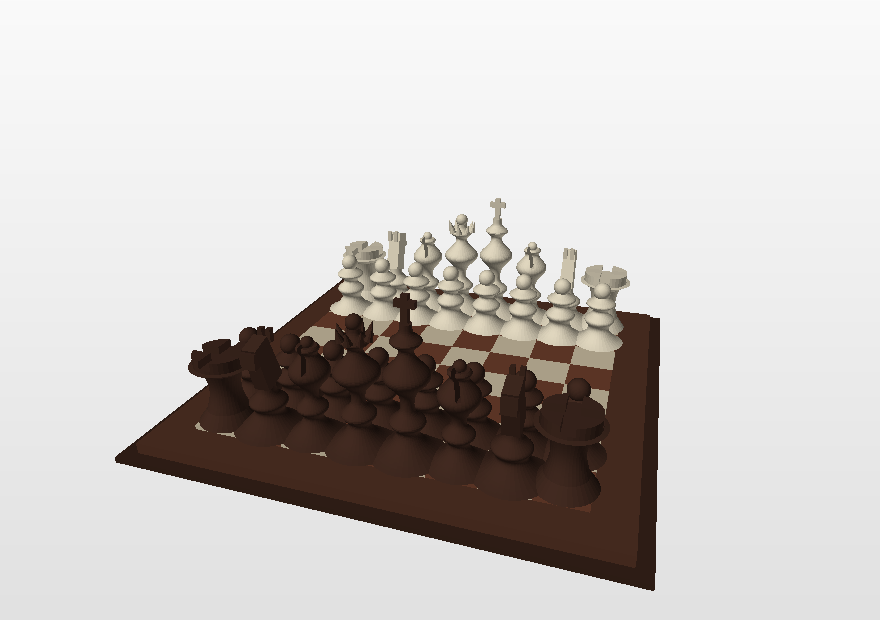
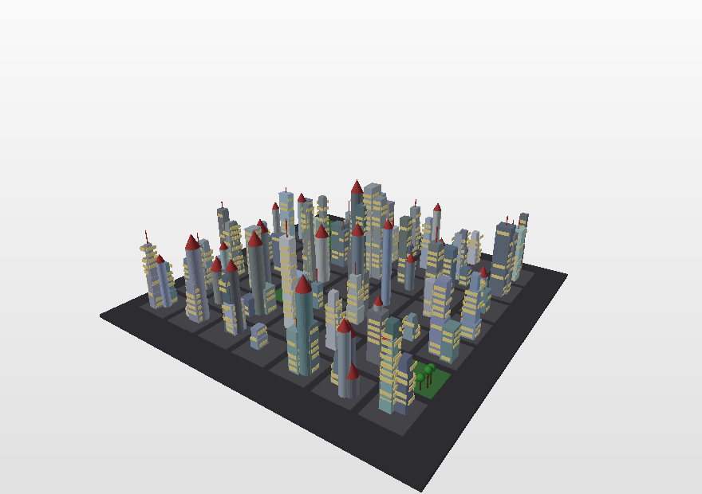
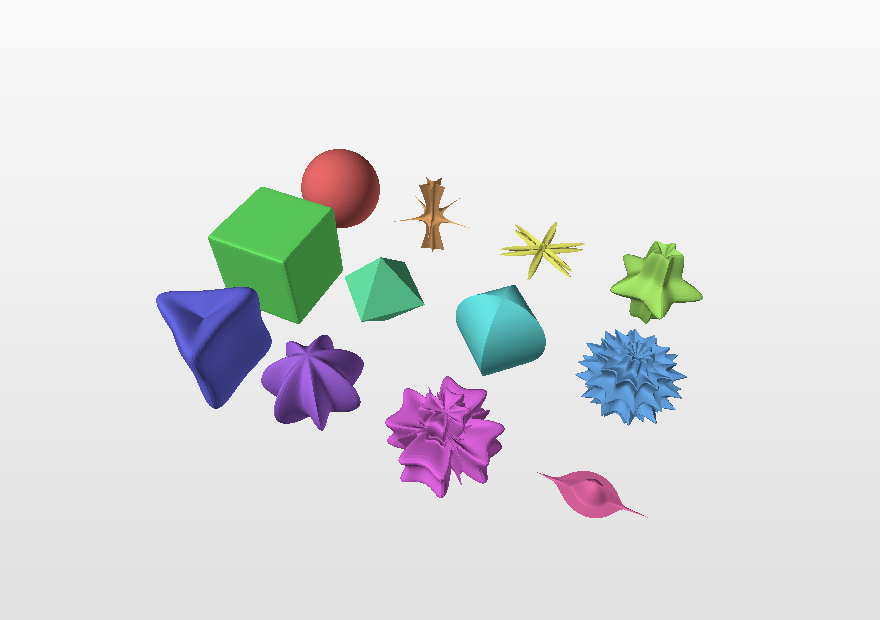
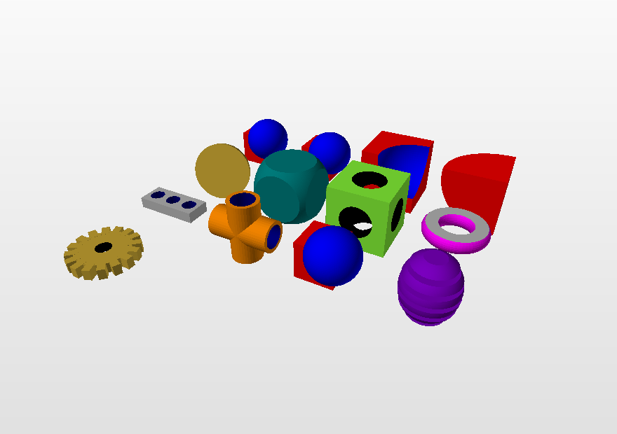

# add.py

**Build 3D models with nothing but Python code.**

One file. Only `math` and `random`. No modelling program, no mesh library,
nothing to install.

[Documentation](https://martynas-sabaliauskas.github.io/add.py/) &middot;
[Gallery](https://martynas-sabaliauskas.github.io/add.py/#gallery) &middot;
[Lietuviškai](README.lt.md)

```python
import add

add.box([0, 0, 0], 2, "red")
add.sphere([3, 0, 0], 1, 20, "blue")
add.cylinder([0, 2, 0], [3, 2, 0], 0.3, 24, "gold")

add.check()                      # 2478 polygons, 3 colours, closed surface
add.save("first_model.off")      # or .obj (+ .mtl), .ply, .stl
```

<p align="center">
  
  
  
  
</p>

Nobody drew any of these. Each is one short program in
[`examples/`](examples/).

---

## Why

`add.py` was written for a second-year university course in which students
are given a deliberately awkward assignment: **make a 3D model, but you may
not touch a modelling program and you may not download a mesh.** Everything
must be computed by a formula or a loop you wrote yourself.

Taking the tools away turns out to make the work more interesting, not less.
A sphere stops being an icon in a toolbar and becomes three lines of
trigonometry. A chess piece becomes a curve spun around an axis. A city
becomes a random number generator and two nested loops. You stop seeing
shapes and start seeing the mathematics inside them.

The library exists so that the interesting part — the geometry — is yours,
and the boring part — keeping track of vertex indices and writing the file —
is not.

## Install

There is nothing to install. Download [`add.py`](add.py), put it next to
your script, and `import add`. It needs Python 3 and nothing else.

```bash
curl -O https://raw.githubusercontent.com/martynas-sabaliauskas/add.py/main/add.py
```

Or clone the repository to get the examples, the tests and the documentation
too.

## What you get

| | |
|---|---|
| **Shapes** | box, cuboid, frame, pyramid, prism, the five Platonic solids, sphere, ellipsoid, torus, capsule, cylinder, tube, cone, frustum, pipe, disc, ring, grid, arrow, helix, voxels |
| **Surfaces** | `parametric(S, ...)` for any `S(u, v)`, with seam wrapping, real thickness and two-sided sheets |
| **Sweeps** | `revolve` (a lathe), `sweep` along a 3D path with scaling and twisting, `extrude`, `loft`, `curve` (a tube along a curve), `ribbon` |
| **Transforms** | move, rotate about any axis, scale, stretch, mirror, place, fit, twist, bend, taper, jitter, and `deform` with any function you like |
| **Patterns** | `repeat`, and linear / grid / radial / mirror arrays |
| **Booleans** | `union`, `intersect`, `difference`, `symmetric_difference`, plus the cheaper `cut` with a plane |
| **Repair** | `clean` (weld, dedupe, remove buried walls), `heal`, `fix_normals`, `triangulate` |
| **Colour** | named colours, hex, HSV, gradients, and `color_by` for a colour that depends on position |
| **Files** | write `.off`, `.obj` + `.mtl`, `.ply`, `.stl`; read `.off`, `.obj`, `.ply` |
| **Checking** | `stats()` and `check()` — polygon count, colours, watertightness, volume |
| **Looking** | `tools/preview.py`, a software renderer that also has no dependencies |

130 public functions, all documented, in one 3500-line file you can read.

## Boolean operations, from scratch

Cutting one solid out of another is the part people expect to need a library
for. This one does it in about six hundred lines of plain Python:

1. Split each face where the other solid's triangles could cross it, found
   through a uniform spatial hash, cutting incrementally so a face stops
   being cut as soon as it moves out of the way.
2. Ask of each piece whether it is inside, outside, or lying on the other
   solid's surface — by shooting a ray and counting crossings.
3. Keep the pieces the operation asks for.

A 6000-face sphere minus a box takes about half a second; 25000 faces takes
about two. The result is welded, has its T-junctions healed, and is
watertight.

```python
add.cuboid([0, 0, 0], [4, 1, 4], "brown")
plate = add.layer()
add.cylinder([0, -1, 0], [0, 1, 0], 0.6, 32, "black")
drill = add.layer()
add.mesh(add.difference(plate, drill))
```

## Coming from add.py 1.2

Everything still works. Models written for 1.2 run unchanged and produce the
same faces — twelve of them are in [`tests/legacy/`](tests/legacy/) and the
test suite checks exactly that. New code can use the clearer names:
`cube2` → `frame`, `cylinder2` → `tube`, `cylinder3` → `cup`,
`cone2` → `cone_open`, `spin3D` → `revolve`, `off` → `save`.

See the [upgrade notes](https://martynas-sabaliauskas.github.io/add.py/#upgrade).

## Repository layout

```
add.py               the library — this is the only file you need
_src/                the sections add.py is assembled from
build.py             concatenates _src/*.py into add.py
examples/            17 commented example programs
  build_all.py       runs them all and renders the pictures
tools/
  preview.py         dependency-free software renderer
  make_docs.py       builds docs/index.html from the docstrings
tests/
  test_add.py        68 unit tests
  test_legacy.py     runs the add.py 1.2 models and checks the face counts
  legacy/            those models, unedited
docs/                the documentation site (English and Lithuanian)
paper/               a paper describing the design and the algorithms
outreach/            a video script and a talk outline
slides/              lecture slides
```

If you edit the library, edit the files in `_src/` and run `python3
build.py`; `add.py` is generated. It ships in the repository so that a
student only ever needs one file.

## Running the tests

```bash
python3 tests/test_add.py        # 68 unit tests
python3 tests/test_legacy.py     # the add.py 1.2 models
python3 examples/build_all.py    # every example, plus pictures
```

The unit tests check the analytic volume of every primitive — a sphere
against 4/3·πr³, a torus against 2π²Rr² — and that every closed shape really
is closed.

## Sharing a model

`save("model.obj")` writes an `.obj` and a `.mtl`. Put both in one archive
and upload it to [Sketchfab](https://sketchfab.com) for a model anyone can
turn around in a browser. For 3D printing, `save("model.stl")` after
`clean(..., normals=True)`.

## Licence

MIT. See [LICENSE](LICENSE).

## Citing

If `add.py` is useful in your teaching or research, see
[CITATION.cff](CITATION.cff) or the [paper](paper/paper.md).

---

Martynas Sabaliauskas, Vilnius University, Faculty of Mathematics and
Informatics, Institute of Data Science and Digital Technologies.
