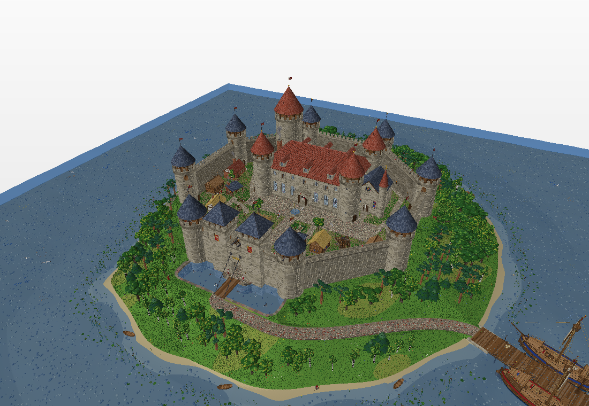
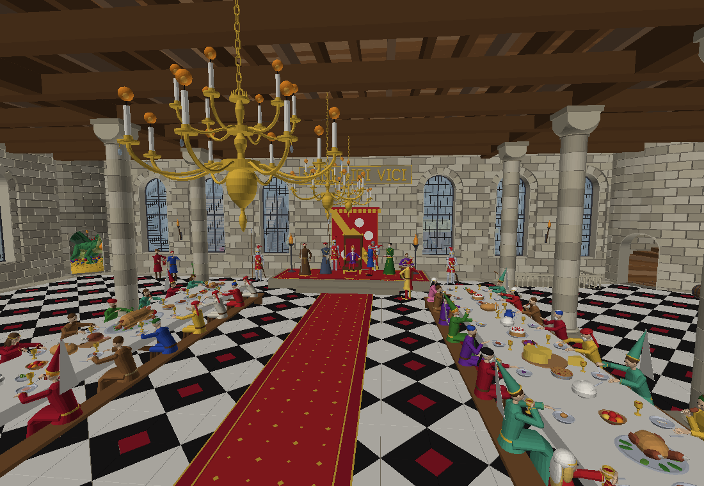
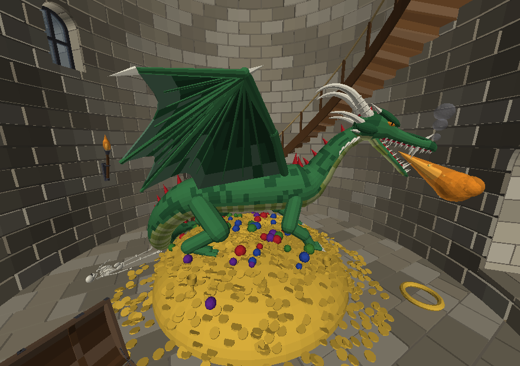
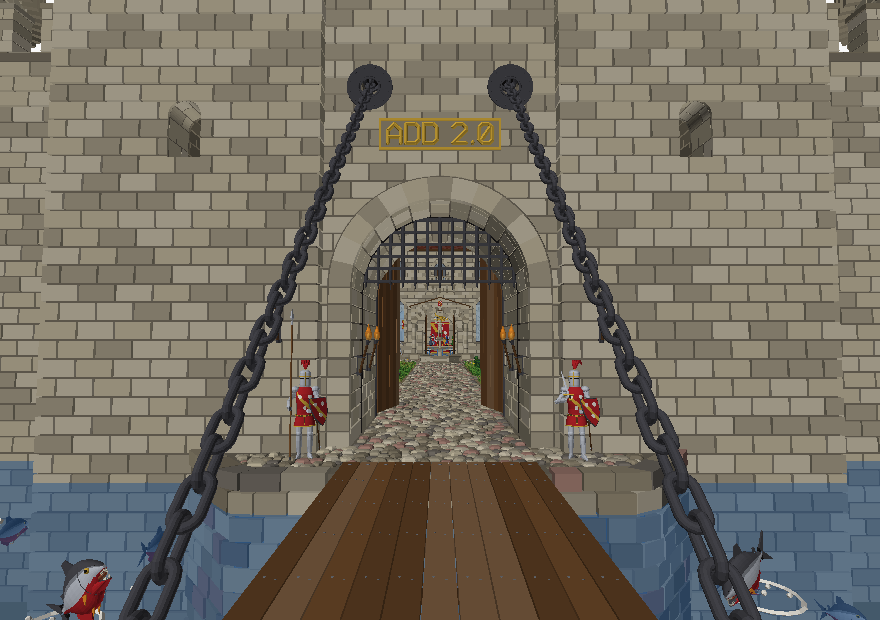
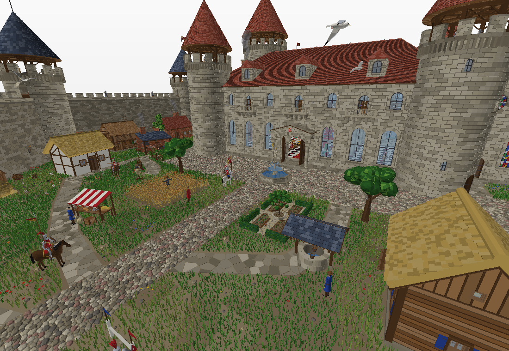
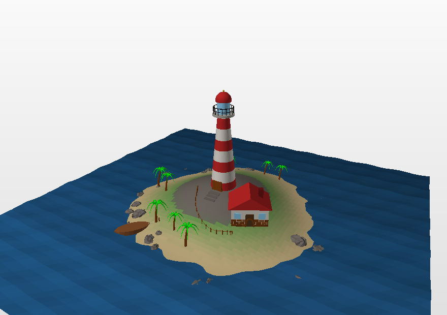
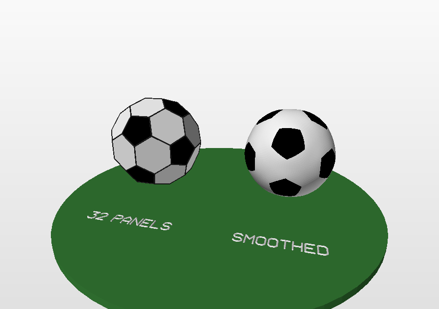
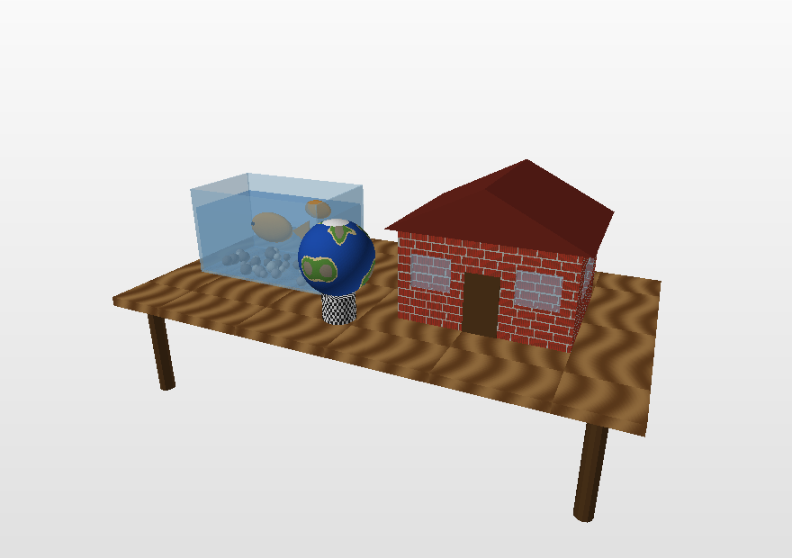
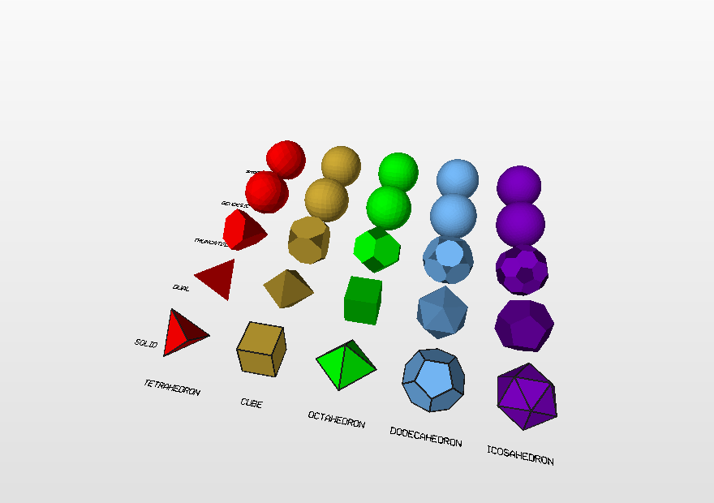

# add.py

**Build 3D models with nothing but code — in Python or in C++.**

One file: [`add.py`](add.py), only `math` and `random` — or, for C++,
[`add.hpp`](add.hpp), only the standard library. No modelling program, no
mesh library, nothing to install.

[Documentation](https://akatasis.github.io/add3d/) &middot;
[Gallery](https://akatasis.github.io/add3d/#gallery) &middot;
[C++](#c) &middot;
[The castle in 3D on Sketchfab](https://skfb.ly/pOnRS) &middot;
[Lietuviškai](README.lt.md)

```python
import add

add.box([0, 0, 0], 2, "red")
add.sphere([3, 0, 0], 1, 20, "blue")
add.cylinder([0, 2, 0], [3, 2, 0], 0.3, 24, "gold")

add.check()                      # 5198 polygons, 3 colours, closed surface
add.save("first_model.off")      # or .obj (+ .mtl), .ply, .stl
```

The same model in C++ — the same functions, and the very same file, byte
for byte:

```cpp
#include "add.hpp"

int main() {
    add::box({0, 0, 0}, 2, "red");
    add::sphere({3, 0, 0}, 1, 20, "blue");
    add::cylinder({0, 2, 0}, {3, 2, 0}, 0.3, 24, "gold");

    add::check();
    add::save("first_model.off");
}
```

<p align="center">
  <a href="https://skfb.ly/pOnRS"></a>
  
  
  
  
  
  
  
  
</p>

Nobody drew any of these. Each is one short program in
[`examples/`](examples/) — all but the castle in Python and in C++. The
castle can be turned round and explored in a browser: **[open it on
Sketchfab](https://skfb.ly/pOnRS)**.

---

## Why

`add.py` was written for a university course in which students are given
a deliberately awkward assignment: **make a 3D model, but you may not touch
a modelling program and you may not download a mesh.** Everything must be
computed by a formula or a loop you wrote yourself. It is for students, and
for anyone who would rather build a shape from mathematics than from menus.

Taking the tools away turns out to make the work more interesting, not less.
A sphere stops being an icon in a toolbar and becomes three lines of
trigonometry. A chess piece becomes a curve spun around an axis. A city
becomes a random number generator and two nested loops. You stop seeing
shapes and start seeing the mathematics inside them.

The library exists so that the interesting part — the geometry — is yours,
and the boring part — keeping track of vertex indices and writing the file —
is not.

## Install

There is nothing to install. Download [`add.py`](add.py), put it next to
your script, and `import add`. It needs Python 3 and nothing else -- not
even `import math`: `math` and `random` are re-exported, so `add.sin`,
`add.pi`, `add.randint` and `add.seed` are all there.

```bash
curl -O https://raw.githubusercontent.com/akatasis/add3d/main/add.py
```

Or clone the repository to get the examples, the tests and the documentation
too. (The module is `add.py`; the repository and the package are called
`add3d`, because the name `add` on PyPI is held by an empty placeholder
registered by someone else -- see [PUBLISHING.md](PUBLISHING.md).)

For C++, download [`add.hpp`](add.hpp) instead, put it next to your
program, `#include "add.hpp"` and compile with any C++17 compiler:

```bash
curl -O https://raw.githubusercontent.com/akatasis/add3d/main/add.hpp
g++ -std=c++17 -O2 model.cpp -o model && ./model      # or clang++
```

## C++

`add.hpp` is the same library for C++, one header file that uses nothing but
the C++17 standard library. Every function of `add.py` is there under the
same name, with the same parameters in the same order and the same
defaults, and it computes the same thing in the same order — the same
random numbers after the same `seed`, the same rounding, the same vertices
and faces in the same order, the same digits in the file. **A C++ program
and a Python program that make the same calls write byte for byte the same
`.off` and `.obj` files**, so a model can be started in one language and
finished in the other, and one file marks both. The tests check this for
every function, for every documentation example and for every example
program.

| Python | C++ |
|---|---|
| `import add` | `#include "add.hpp"` |
| a point `[1, 2, 3]` | `{1, 2, 3}` (an `add::Point`: `p[0]` or `p.x`) |
| a colour `"red"`, `[255, 0, 0]` | `"red"`, `{255, 0, 0}` |
| keyword arguments: `add.sweep(P, path, closed=True)` | every argument in order: `add::sweep(P, path, 0, 1, 100, add::DEFAULT_COLOR, true)` |
| no mesh (the scene): `add.bbox()` | the overload without the mesh: `add::bbox()` |
| `lambda t: [t, 0, 0]` | `[](double t) { return add::Point{t, 0, 0}; }` |
| `add.make(add.box, [0, 0, 0], 2)` | `add::make([] { add::box({0, 0, 0}, 2); })` |
| `add.union(a, b)` | `add::union_(a, b)` (`union` is a keyword) |
| `print(add.center(M))` | `std::cout << add::center(M)` — prints `[1.0, 2.0, 3.0]` too |

The [documentation](https://akatasis.github.io/add3d/#cpp) gives the C++
declaration of every function and every example in both languages; 42 of
the programs in [`examples/`](examples/) have a C++ twin (`NN_name.cpp` next
to `NN_name.py`). On an ARM computer (a Mac with Apple Silicon, say) compile
with `-ffp-contract=off` too, so that no multiply and add in your own
formulas is fused into one rounding; on an x86-64 PC it makes no difference.

## What you get

| | |
|---|---|
| **Shapes** | box, cuboid, rounded_box, frame, pyramid, prism, the five regular polyhedra (`tetrahedron` ... `icosahedron`, each centred on its vertex average), a geodesic `sphere` of triangles, `quadsphere`, hemisphere, ellipsoid, torus, capsule, cylinder, tube, cone, frustum, pipe, disc, ring, grid, arrow, helix, voxels |
| **Parts** | beam (a bar between two points), arch, stairs, gear, wheel, roof, column, bricks, tree, pixels (pixel art), heightmap (block terrain), wireframe, text (a built-in stroke font with Lithuanian letters) |
| **Surfaces** | `parametric(S, ...)` for any `S(u, v)`, with seam wrapping, real thickness, two-sided sheets and a *colour function* of `(u, v)`; a catalogue of 25 named surfaces (`surface("klein_bottle", ...)`) |
| **Sweeps** | `revolve` (a lathe), `sweep` along a 3D path with scaling and twisting, `extrude`, `loft`, `curve` / `polyline` (tubes), `ribbon`, `trace` (the path of a vector field) |
| **Profiles** | ready-made cross-sections: circle, ellipse, polygon, star, rounded rectangle, gear; `chaikin` corner rounding |
| **Transforms** | move, rotate about any axis, scale, stretch, mirror, place, fit, aim, ground, align, twist, bend, taper, jitter, and `deform` with any function you like |
| **Patterns** | `repeat`, linear / grid / radial / mirror arrays, `scatter` on random points, `along` a curve |
| **Booleans** | `union`, `intersect`, `difference`, `symmetric_difference`, plus the cheaper `cut` with a plane |
| **Smoothing** | `catmull_clark`, and `smooth` -- the generalised Catmull-Clark algorithm: any number of cells per control edge, every vertex on the limit surface |
| **Vertex tools** | `set_vertex`, `neighbors`, `valence`, `mean_neighbor_distance`, `edges`, `vertex_normal`, `face_center`, `boundary_loops`, `dual`, `truncate`, `refine`, `spherify`, `inflate` |
| **Repair** | `clean` (weld repeated vertices, remove repeated and buried faces, cut back faces that overlap in one plane so nothing flickers, and cut the patch where two solids stand on each other out of both, so the union stays watertight -- `save` and `stream` do this on the way to the file), `overlaps`, `heal`, `fix_normals`, `triangulate` |
| **Colour** | named colours, hex, HSV, gradients, `color_by` for a colour that depends on position, `limit_colors` for a Sketchfab-sized palette |
| **Glass and pictures** | `transparent` / `opacity` for see-through surfaces and `texture` for image textures, both written to the `.mtl` file; `write_png` for pictures you compute yourself |
| **Files** | write `.off`, `.obj` + `.mtl`, `.ply`, `.stl`; read `.off`, `.obj`, `.ply`; `obj_size` before writing; `stream` writes a model part by part, so it can be bigger than the memory of the computer |
| **Checking** | `stats()` and `check()` — polygon count, colours, watertightness, volume, and the Sketchfab limits (50 MB, 50 materials) |
| **Looking** | `tools/preview.py`, a software renderer that also has no dependencies; it streams a file too big to load (the castle, over 500 MB) |

235 public names, every one documented in English and Lithuanian with a
runnable example in Python and in C++, in one 8000-line file you can read —
and its C++ twin, one 10,000-line header.

## Boolean operations, from scratch

Cutting one solid out of another is the part people expect to need a library
for. This one does it in about six hundred lines of plain Python:

1. Split each face where the other solid's triangles could cross it, found
   through a uniform spatial hash, cutting incrementally so a face stops
   being cut as soon as it moves out of the way.
2. Ask of each piece whether it is inside, outside, or lying on the other
   solid's surface — by shooting a ray and counting crossings.
3. Keep the pieces the operation asks for.

A 6000-face sphere minus a box takes about half a second; 25000 faces takes
about two. The result is welded, has its T-junctions healed, and is
watertight.

```python
add.cuboid([0, 0, 0], [4, 1, 4], "brown")
plate = add.layer()
add.cylinder([0, -1, 0], [0, 1, 0], 0.6, 32, "black")
drill = add.layer()
add.mesh(add.difference(plate, drill))
```

## Smooth surfaces, from a few polygons

A box with a corner pulled out, a letter made of blocks, a dodecahedron —
any polygon mesh can be treated as the control net of a smooth surface.
`catmull_clark` is the classical subdivision. `smooth(M, n)` is the
generalised algorithm described in
[*Uniform n-grids on Catmull–Clark limit surfaces of arbitrary polygon
meshes*](paper/): it puts `n` cells on every control edge for **any** `n`
(classical subdivision only reaches 2, 4, 8, ...), with every new vertex
exactly on the limit surface and evenly sized cells around the
extraordinary vertices — a line-by-line port of the reference
implementation into plain Python, cross-checked against it to 1e-15.

```python
add.box([0, 0, 0], 2, "gold")
block = add.layer()
block = add.set_vertex(block, add.nearest_vertex(block, [1, 1, 1]), [2.5, 2.5, None])
add.mesh(add.smooth(block, 8))          # 8 cells per edge, colours kept per face
```

## Coming from add.py 1.2

Everything still works. Models written for 1.2 run unchanged and produce the
same faces — twelve of them are in [`tests/legacy/`](tests/legacy/) and the
test suite checks exactly that. (One deliberate change: `sphere` is now a
geodesic sphere of triangles, so a model with spheres has different faces;
`quadsphere` is the old construction.) New code can use the clearer names:
`cube2` → `frame`, `cylinder2` → `tube`, `cylinder3` → `cup`,
`cone2` → `cone_open`, `spin3D` → `revolve`, `off` → `save`.

See the [upgrade notes](https://akatasis.github.io/add3d/#upgrade).

## Complete models

The later examples are whole scenes of the kind the course asks for, each
about a hundred lines and each using a different corner of the library:
a [lighthouse island](examples/22_lighthouse.py), a
[steam locomotive](examples/23_locomotive.py) whose rods follow the wheel
angle, a [windmill](examples/24_windmill.py), a
[round temple](examples/25_temple.py), [strange attractors and vector
fields](examples/26_vector_fields.py), a [robot](examples/27_robot.py)
reaching for a ball, a [voxel island](examples/28_voxel_island.py), [two
bridges](examples/29_bridge.py), a [solar system](examples/30_solar_system.py)
with banded planets, a [workbench](examples/31_workbench.py) of measuring
and repair tools, a [still life](examples/32_old_names.py) in the 1.2
vocabulary, a [gallery of cross-sections](examples/33_cross_sections.py),
the [surface zoo](examples/34_surface_zoo.py), a [knotted
curve](examples/35_knot_curve.py), the [Minecraft
sphere](examples/36_minecraft_sphere.py) in three constructions, a
[football](examples/37_football.py) built from the vertices of an
icosahedron, the [five polyhedra](examples/38_polyhedra.py) with their
duals, truncations and smooth versions, [smoothing](examples/39_smooth_shapes.py)
of pulled boxes and prisms, [vertex tools](examples/40_vertex_tools.py), a
[Sketchfab-ready](examples/41_sketchfab_ready.py) colourful model, [pillow
letters](examples/42_pillow_letters.py), a [planet](examples/43_planet.py),
a [geodesic dome](examples/44_geodesic_dome.py) house, [glass and
textures](examples/45_glass_and_textures.py) -- and the
[castle](examples/46_castle.py): an island in a transparent lake with
schools of fish, three sharks and the wreck of a rowing boat beside a sea
chest of gold, meadows of grass and
flowers, an octagonal wall of individual stone blocks with eight hollow
towers -- spiral stairs, doors onto the wall walk, lookouts on top -- a
gatehouse with a portcullis and a drawbridge hanging on real chains over a
moat lined with stone that comes right up to the walls, piranhas in it,
guns on the towers and over the gate with their gunners, a road paved with
fieldstones from the bridge along the moat and gently down round the hill
to a harbour where two great ships, clinker-built of planks and with their
crews aboard, lie moored at a wharf by ropes laid of three strands and
rowing boats are tied up all round the shore, a palace with glass windows, a Romanesque porch of stone,
stone balconies on corbels, dormers and a roof of single tiles, a chapel
with stained glass, rose windows in its gables, an altar and the royal
graves behind it, a courtyard with a well, a fountain with Neptune, a
wooden dovecote with doves about the roofs, a smithy, a kitchen with a
hearth and a bread oven, log houses with hay lofts and a cottage, all
furnished, a storehouse, a market, a stable, a pigsty with its pigs,
kennels, cats, a privy by each of six walls, knot gardens, a field of rye, archery butts, a trebuchet,
cannons with their crews, carts, barrels, crates, weapon racks, knights
in armour on foot and on horseback (two of them jousting at the tilt),
archers and crossbowmen each in a stance of his own, townsfolk, horses,
chickens and dogs, cows grazing outside the walls, fishermen on the wharf, spruces,
pines, birches, oaks, elms and limes on the slopes with hares, foxes and
wolves running among them, gulls over the lake -- and, inside, the easter
eggs: the great hall, its stone columns and gilded chandeliers, with the
king on his throne, his counsellor, his fool and musicians, a feast for
thirty-two guests, a chess study ("White to
play and win") and a stair down to the vaulted wine cellar, the soldiers'
dormitory upstairs, laid out in bays like a real one, an attic where the
guests sleep among old things (the lords in four-posters), the
chapel's attic with the vestments and the chalice, and in the big tower
the treasury with a winged dragon breathing fire over the gold, the
armoury and the lord's chamber above it; everyone who lives in the castle
has a bed. There are no textures: every stone block, roof tile,
cobblestone, pane of stained glass and coat of arms is geometry.
`python3 46_castle.py` streams the model to `castle.off` (over 500 MB) and
`castle.obj` at once, tidied on the way (no repeated vertices, no
repeated, buried or overlapping faces), under 100 colours; compressed with
7-Zip the `.obj` is under 100 MB, which is what Sketchfab takes --
**[the castle on Sketchfab](https://skfb.ly/pOnRS)**.
`python3 tools/coverage.py` lists which example uses which function; every
public function is used by at least one, and every model fits the
Sketchfab limits (`examples/build_all.py` checks).

## Repository layout

```
add.py               the library — this is the only file you need
add.hpp              the same library for C++ (one header, C++17)
_src/                the sections add.py is assembled from
_cpp/                the sections add.hpp is assembled from
build.py             assembles add.py from _src/ and add.hpp from _cpp/
examples/            43 commented example programs (studies and complete models)
  NN_name.cpp        the C++ twin of NN_name.py (all but the castle)
  add.py, add.hpp    copies of the library, so the examples run as they are
  build_all.py       runs them all, checks the Sketchfab limits, renders the pictures
tools/
  preview.py         dependency-free software renderer
  castle_photos.py   sixty-two photographs of the castle, taken with preview.py
  make_docs.py       builds docs/index.html from the docstrings, docs/reference.py
                     and docs/reference_cpp.py
  coverage.py        which example uses which function
tests/
  test_add.py        94 unit tests
  test_legacy.py     runs the add.py 1.2 models and checks the face counts
  test_docs.py       runs the example of every documented function
  legacy/            those models, unedited
  cpp/               the C++ tests: every function and every documentation
                     example in both languages, compared file by file
docs/                the documentation site (English and Lithuanian)
  reference.py       a Lithuanian explanation and an example for every function
  reference_cpp.py   the same examples in C++
paper/               a paper describing the design and the algorithms
outreach/            a video script and a talk outline
slides/              lecture slides
```

If you edit the library, edit the files in `_src/` (and their twins in
`_cpp/`) and run `python3 build.py`; `add.py` and `add.hpp` (and their
copies in `examples/`) are generated. They ship in the repository so that a
student only ever needs one file.

## Running the tests

```bash
python3 tests/test_add.py        # 94 unit tests
python3 tests/test_legacy.py     # the add.py 1.2 models
python3 tests/test_docs.py       # the 235 documentation examples
python3 examples/build_all.py    # every example, the Sketchfab check, pictures

python3 tests/cpp/run_parity.py      # C++: every function, the same files as Python
python3 tests/cpp/run_docs.py        # C++: the 235 documentation examples
python3 examples/build_all.py --cpp  # C++: the 42 example programs
```

The unit tests check the analytic volume of every primitive — a sphere
against 4/3·πr³, a torus against 2π²Rr² — that every closed shape really is
closed, that the generalised subdivision reproduces classical Catmull–Clark
for n = 2, 4, 8 and gives Euler characteristic 2 for every n, and that
`.obj` files round-trip with their opacity and textures. They pass on
Python 3.8 to 3.13. The C++ tests compile with GCC and Clang and compare
every file the C++ writes with the one Python writes (over 1300 files from
the functions alone), byte for byte.

## Sharing a model

`save("model.obj")` writes an `.obj` and a `.mtl` (plus any texture images
you used). Put them in one archive and upload it to
[Sketchfab](https://sketchfab.com) for a model anyone can turn around in a
browser, as [the castle](https://skfb.ly/pOnRS) is. Sketchfab accepts up to
100 MB on the free plan and merges materials beyond 100; `check()` warns at
the course's limits of 50 MB and 50 colours, and
`save("model.obj", colors=50)` reduces a colourful model to fit. For 3D
printing, `save("model.stl")` after `clean(..., normals=True)`.

## Publishing

[PUBLISHING.md](PUBLISHING.md) explains how to put the repository on GitHub,
switch on the documentation site and, if wanted, release `add3d` on PyPI.

## Licence

MIT. See [LICENSE](LICENSE).

## Citing

If `add.py` is useful in your teaching or research, see
[CITATION.cff](CITATION.cff) or the [paper](paper/paper.md).

---

Martynas Sabaliauskas, Vilnius University, Faculty of Mathematics and
Informatics, Institute of Data Science and Digital Technologies.
